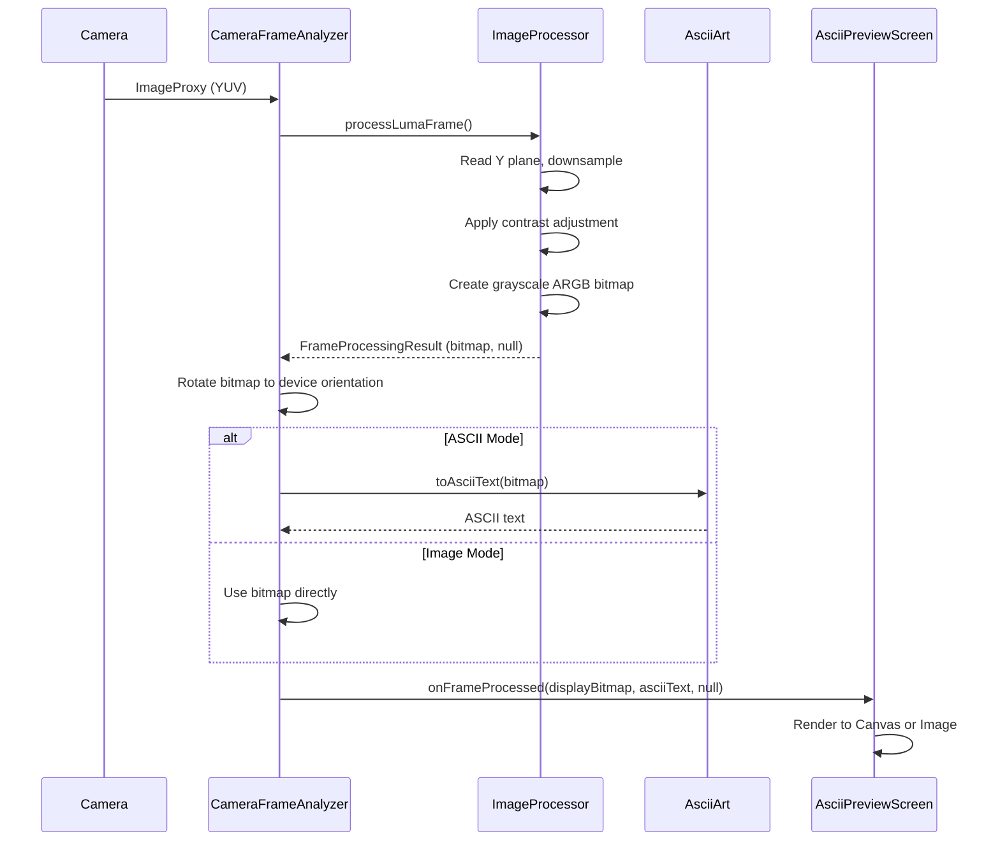
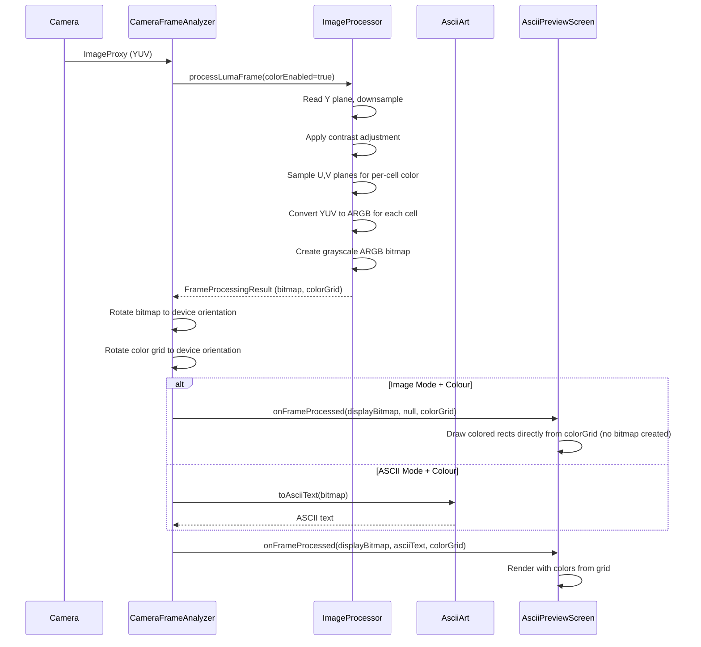
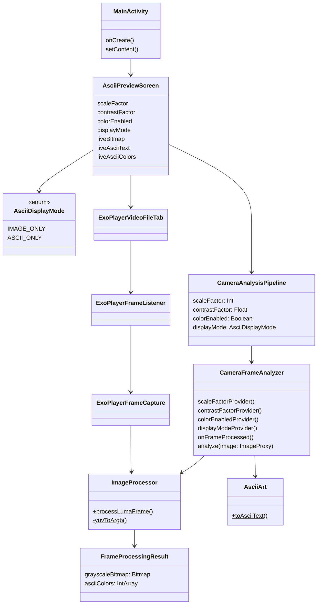
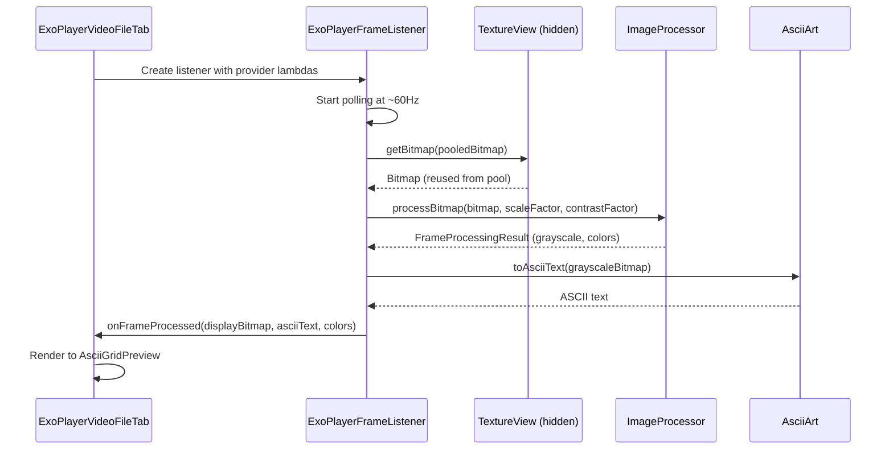
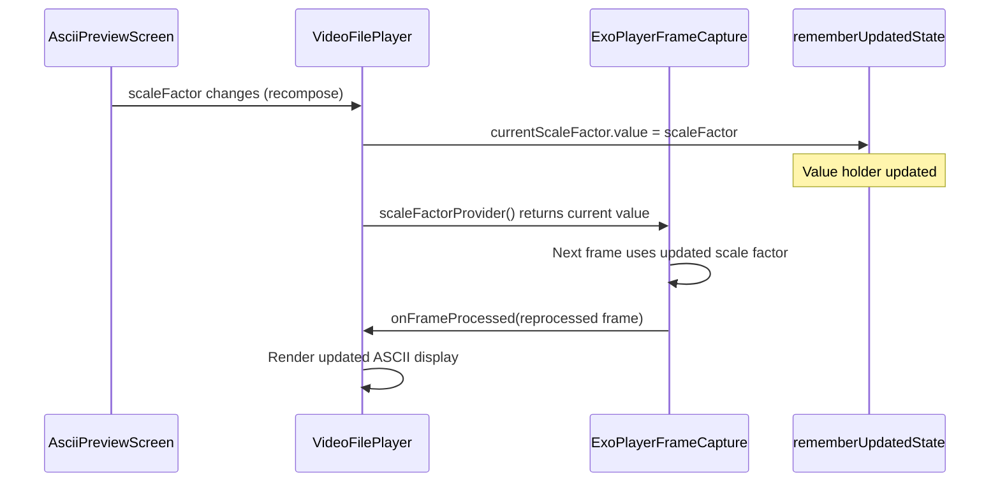

# ASCII Art

## What this app does
This Android app provides two input sources for real-time ASCII art generation:

### Live Camera Tab
Takes live camera input, downsamples it into a coarse grid, and renders that grid as either:
- a de-res image (`Image` mode), or
- ASCII art (`ASCII` mode).

### Video File Tab
Loads video files from device storage and applies the same ASCII pipeline in real-time.

Both tabs support a **Colour** toggle:
- **Off:** output is grayscale-based.
- **On:** each de-res cell is assigned a sampled color, and ASCII glyphs (and Image mode cells) use that color.

## Screenshots

| Live Camera Tab | Video File Tab |
|---|---|
| ![Live Camera tab showing ASCII art output from the device camera][screenshot-live] | ![Video File tab showing the Load, Restart, Play and Pause control bar with ASCII art output from a video file][screenshot-video] |

[screenshot-live]: docs/screenshot_live_camera.png
[screenshot-video]: docs/screenshot_video_file.png

## Why this was created
This project was created as an exploration of **GitHub Copilot’s capability** to iteratively design, implement, debug, and refine a non-trivial real-time graphics pipeline in an Android app.

## High-level graphics pipeline

### Live Camera Pipeline
1. Acquire camera frames with CameraX `ImageAnalysis` using `KEEP_ONLY_LATEST`.
2. Read luma (Y) and downsample according to user scale factor.
3. Apply contrast adjustment to luma values before output mapping.
4. Build:
   - a grayscale de-res bitmap, and
   - (when Colour is enabled) a per-cell ARGB color grid sampled from YUV.
5. Rotate processed output to device orientation.
6. Render either image cells or ASCII cells in Compose.

### Video File Pipeline
1. Load video file using ExoPlayer 2.19.1.
2. Poll playback position at ~60Hz to detect new frames.
3. Extract frames via `TextureView.getBitmap()` from a hidden zero-alpha `TextureView` that ExoPlayer renders to. Bitmaps are reused from a pool (`ConcurrentLinkedQueue`) to eliminate per-frame allocation.
4. Process frames through the same pipeline as live camera:
   - Downsample according to scale factor
   - Apply contrast adjustment
   - Generate grayscale bitmap and optional color grid
5. Render to UI with real-time parameter responsiveness.

## ASCII mapping algorithm
For each de-res cell:
1. Use the cell grayscale intensity (0..255).
2. Invert the intensity: `mappedValue = 255 - intensity`. This ensures that bright areas of the scene map to dense characters (e.g. `@`, `#`) and dark areas map to sparse characters (e.g. space, `.`), which is correct for white-on-black display.
3. Map that inverted value to an index in a density-sorted printable ASCII character list.
4. Render the selected character at the corresponding on-screen cell bounds.

Character choice logic does **not** change when Colour is enabled; colour is applied as an additional rendering layer.

## Character density model
Character density is computed by rasterizing each candidate printable ASCII character into a fixed one-character bitmap grid and measuring occupancy:

`density = lit_pixels / total_pixels`

Characters are sorted by this density, from sparse (e.g. space) to dense. Grayscale intensity is then mapped across that ordered list.

## Current controls
- **Scale factor** slider: controls downsampling resolution (2–48×).
- **Contrast** slider: adjusts contrast before mapping.
- **Mode chips**: `Image` / `ASCII` (radio group, shared across both tabs).
- **Colour** toggle: enables per-cell color output (affects both Live Camera and Video File).
- **Tab selector**: switch between Live Camera and Video File input sources.

## Notes
- App is portrait-locked.
- Edge-to-edge/system bar transparency is configured.
- Camera permission is requested at runtime.
- Video file must be placed in `/sdcard/Download/` directory.
- Scale factor and contrast adjustments update in real-time on both tabs.
- Colour toggle applies dynamically (no need to restart video playback).

## Architecture Diagrams

### Grayscale Mode Sequence

### Colour Mode Sequence

### Static Class Diagram

| Class | Description |
|---|---|
| `MainActivity` | The app's single Android `Activity`. Configures edge-to-edge / transparent system bar styling and hosts the root Compose content via `setContent`. |
| `AsciiPreviewScreen` | Root composable screen. Owns all shared UI state — scale factor, contrast, colour toggle, display mode, and the current live frame — and renders the control panel plus the tab selector. |
| `CameraAnalysisPipeline` | Private composable that wires up CameraX `ImageAnalysis`, binds it to the `LifecycleOwner`, and forwards each raw camera frame to a `CameraFrameAnalyzer` instance. |
| `CameraFrameAnalyzer` | Implements `ImageAnalysis.Analyzer`. Receives raw YUV `ImageProxy` frames from CameraX, delegates pixel processing to `ImageProcessor`, applies the sensor-orientation rotation correction, optionally generates ASCII text, and posts results to the UI thread. |
| `ImageProcessor` | Singleton. Downsamples luma data from a YUV `ImageProxy` or an existing `Bitmap`, applies contrast adjustment, and produces a grayscale `Bitmap` plus an optional per-cell ARGB colour array. Maintains pre-allocated `IntArray` pixel buffers (grown only on dimension increase) to eliminate per-frame heap allocation. |
| `FrameProcessingResult` | Immutable data class that carries the output of a single `ImageProcessor` call: a downsampled grayscale `Bitmap` and an optional `IntArray` of per-cell ARGB colours. |
| `AsciiArt` | Singleton. Converts a grayscale bitmap to a multi-line ASCII `String` by mapping each pixel's inverted intensity (`255 - gray`) to a character chosen from a density-sorted printable ASCII set. Caches the sorted character set per preset to avoid re-measuring on every frame. |
| `AsciiDisplayMode` | Enum with two values — `IMAGE` (render de-res bitmap cells) and `ASCII` (render character glyphs) — shared across both tabs. |
| `ExoPlayerVideoFileTab` | Composable for the Video File tab. Creates and manages the `ExoPlayer` instance and its lifecycle. Provides a persistent control bar (Load, Restart, Play, Pause) visible in both IMAGE and ASCII modes. Delegates frame extraction to `ExoPlayerFrameListener` and renders the ASCII or image output. |
| `ExoPlayerFrameListener` | Bridges ExoPlayer playback and ASCII processing. Polls the player position at ~60 Hz on the main thread, captures rendered frames via `TextureView.getBitmap()` into a `Channel<Bitmap>`, and processes them on an IO thread via `ImageProcessor` and `AsciiArt`. |
| `ExoPlayerFrameCapture` | Represents the frame-extraction step handled inside `ExoPlayerFrameListener`: captures a `Bitmap` from the hidden `TextureView` that ExoPlayer renders to in ASCII mode, scales it down, then routes it through `ImageProcessor` and `AsciiArt` to produce the final display output. |

### Video File Processing Sequence

### Shared Parameter Update Flow

