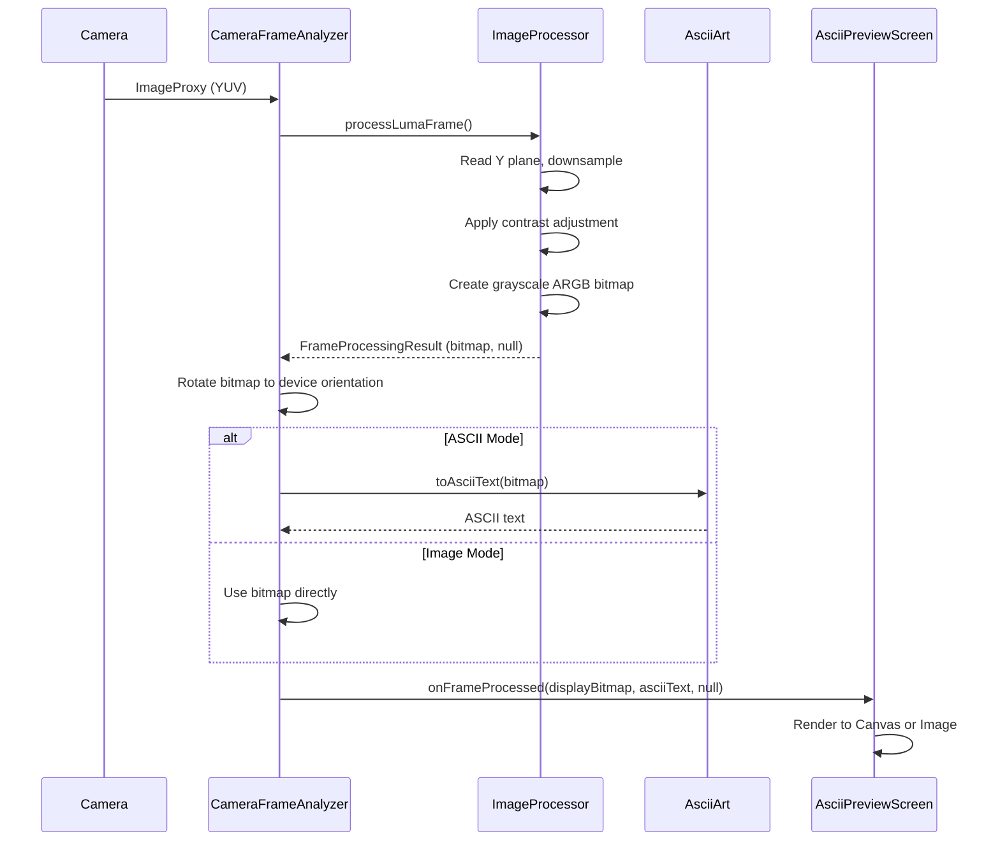
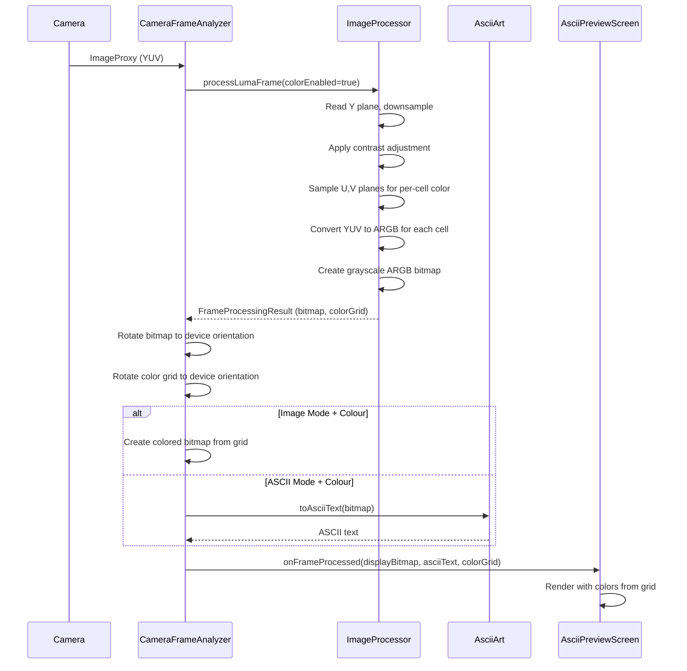
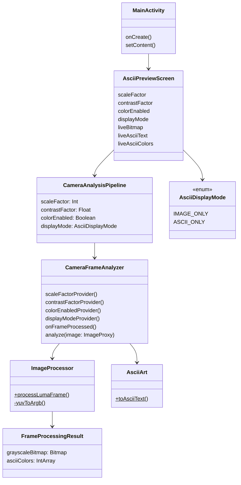

# ASCII Art

## What this app does
This Android app takes live camera input, downsamples it into a coarse grid, and renders that grid as either:
- a de-res image (`Image` mode), or
- ASCII art (`ASCII` mode).

It also supports a **Colour** toggle:
- **Off:** output is grayscale-based.
- **On:** each de-res cell is assigned a sampled color, and ASCII glyphs (and Image mode cells) use that color.

## Why this was created
This project was created as an exploration of **GitHub Copilot’s capability** to iteratively design, implement, debug, and refine a non-trivial real-time graphics pipeline in an Android app.

## High-level graphics pipeline
1. Acquire camera frames with CameraX `ImageAnalysis` using `KEEP_ONLY_LATEST`.
2. Read luma (Y) and downsample according to user scale factor.
3. Apply contrast adjustment to luma values before output mapping.
4. Build:
   - a grayscale de-res bitmap, and
   - (when Colour is enabled) a per-cell ARGB color grid sampled from YUV.
5. Rotate processed output to device orientation.
6. Render either image cells or ASCII cells in Compose.

## ASCII mapping algorithm
For each de-res cell:
1. Use the cell grayscale intensity (0..255).
2. Map that value to an index in a density-sorted printable ASCII character list.
3. Render the selected character at the corresponding on-screen cell bounds.

Character choice logic does **not** change when Colour is enabled; colour is applied as an additional rendering layer.

## Character density model
Character density is computed by rasterizing each candidate printable ASCII character into a fixed one-character bitmap grid and measuring occupancy:

`density = lit_pixels / total_pixels`

Characters are sorted by this density, from sparse (e.g. space) to dense. Grayscale intensity is then mapped across that ordered list.

## Current controls
- **Scale factor** slider: controls downsampling resolution.
- **Contrast** slider: adjusts contrast before mapping.
- **Mode chips**: `Image` / `ASCII`.
- **Colour** toggle: enables per-cell color output.

## Notes
- App is portrait-locked.
- Edge-to-edge/system bar transparency is configured.
- Camera permission is requested at runtime.

## Architecture Diagrams

### Grayscale Mode Sequence

### Colour Mode Sequence

### Static Class Diagram

